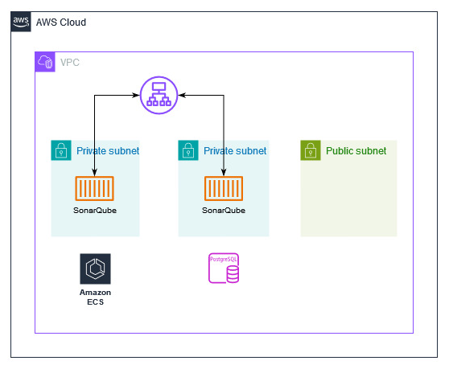

# sonarqube-on-ecs

Given the need to establish a SonarQube environment with a focus on security, scalability, and ease of maintenance, I've opted for the following technology stack for its creation and deployment:

* Infrastructure as Code (IaC) with Terraform
* Amazon Web Services (AWS)
* Elastic Container Service (ECS)
* Amazon RDS
* SonarQube

The architecture of this environment is illustrated in the diagram below:

